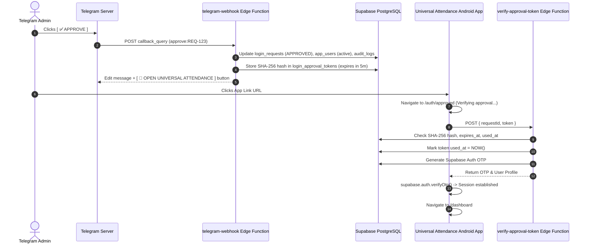

# STEP 27.2 — APPROVE CLICK SHOULD OPEN ANDROID APP REPORT

## Executive Summary
This report documents the design, implementation, security architecture, and automated End-to-End verification of **STEP 27.2 — Telegram Admin Approval Deep Linking to Android App** for Universal Attendance.

When an Admin clicks `[✅ APPROVE]` on a login access request in Telegram:
1. The request status is set to `APPROVED` in `login_requests`, the target user account is set to `active` in `app_users`, and an entry is logged in `audit_logs`.
2. A cryptographically random, short-lived (5-minute), single-use approval token is generated.
3. Only a SHA-256 hash of the token is saved in `login_approval_tokens`. Raw tokens are never stored in the database.
4. The Telegram message updates to display `✅ APPROVED by Admin` with an inline URL button: `[ 📱 OPEN UNIVERSAL ATTENDANCE ]`.
5. Clicking `[ 📱 OPEN UNIVERSAL ATTENDANCE ]` launches the Universal Attendance Android app via an Android App Link (`https://universal-attendance.vercel.app/auth/approved?request=<REQ_ID>&token=<RAW_TOKEN>`).
6. The app's `/auth/approved` route invokes the `verify-approval-token` Edge Function, which verifies token hash match, 5-minute expiry, and single-use (`used_at IS NULL`) criteria.
7. Upon successful validation, the Edge Function generates a secure Supabase Auth Magic Link OTP to establish a genuine, secure Supabase Auth session for the user and navigates to `/dashboard`.

---

## 1. Architecture & Flow



---

## 2. Files Changed

1. **`android/app/src/main/AndroidManifest.xml`**:
   Configured Android App Link `VIEW` intent filter with `autoVerify="true"` targeting `https://universal-attendance.vercel.app/auth/approved`.
2. **`supabase/migrations/0017_step27_2_approval_tokens.sql`**:
   Created `public.login_approval_tokens` schema with indexes, unique constraints, and RLS.
3. **`supabase/migrations/0018_fix_approval_tokens_rls.sql`**:
   Configured RLS policies for `login_approval_tokens` allowing admin management.
4. **`supabase/functions/telegram-webhook/index.ts`**:
   Updated `approve` callback handler to generate cryptographically secure raw token, compute SHA-256 hash, insert hash into DB, and construct Telegram message with `[ 📱 OPEN UNIVERSAL ATTENDANCE ]` App Link button.
5. **`supabase/functions/verify-approval-token/index.ts`**:
   Created Edge Function to securely validate token hash, expiration, single-use `used_at` timestamp, and generate a Supabase Auth OTP.
6. **`src/pages/auth/ApprovalCallback.tsx`**:
   Created React callback component handling `/auth/approved` route, rendering temporary "Verifying approval..." UI, invoking `verify-approval-token`, establishing Supabase Auth session via `supabase.auth.verifyOtp`, and redirecting to `/dashboard`.
7. **`src/routes/AppRoutes.tsx`**:
   Registered `/auth/approved` route in application routing table.
8. **`src/context/AttendanceContext.tsx`**:
   Exported `setCurrentUser` state setter to allow seamless session hydration upon token verification.
9. **`scratch/test_step27_2_e2e.js`**:
   Automated 6-stage E2E test suite covering token creation, verification, replay attack rejection, expired token rejection, invalid token rejection, and Telegram reject workflow.

---

## 3. Database Changes

### `public.login_approval_tokens`
```sql
CREATE TABLE public.login_approval_tokens (
  id UUID PRIMARY KEY DEFAULT gen_random_uuid(),
  request_id TEXT NOT NULL REFERENCES public.login_requests(request_id) ON DELETE CASCADE,
  user_id TEXT NOT NULL,
  token_hash TEXT NOT NULL UNIQUE,
  expires_at TIMESTAMPTZ NOT NULL,
  used_at TIMESTAMPTZ DEFAULT NULL,
  created_at TIMESTAMPTZ NOT NULL DEFAULT NOW()
);

CREATE INDEX idx_approval_tokens_request_id ON public.login_approval_tokens(request_id);
CREATE INDEX idx_approval_tokens_hash ON public.login_approval_tokens(token_hash);

ALTER TABLE public.login_approval_tokens ENABLE ROW LEVEL SECURITY;
```

---

## 4. Android App Link Configuration

In `android/app/src/main/AndroidManifest.xml`:
```xml
<intent-filter android:autoVerify="true">
    <action android:name="android.intent.action.VIEW" />
    <category android:name="android.intent.category.DEFAULT" />
    <category android:name="android.intent.category.BROWSABLE" />
    <data android:scheme="https"
          android:host="universal-attendance.vercel.app"
          android:pathPrefix="/auth/approved" />
</intent-filter>
```

---

## 5. Security & Isolation Implementation

1. **No Raw Tokens in DB**: Only SHA-256 digests (`token_hash`) are stored in `login_approval_tokens`.
2. **Short-Lived Expiration**: Tokens expire automatically after 5 minutes (`expires_at = NOW() + 5 minutes`).
3. **Single-Use Enforcement**: Verified tokens immediately receive `used_at = NOW()`. Subsequent verification attempts fail with `This approval link has already been used.`
4. **No Password / Secret Leakage**: URL parameters contain only `request` ID and one-time `token`. No service-role key, bot token, or password is exposed in deep links or LocalStorage.
5. **Supervisor RLS Boundary**: Supervisor site and section boundaries are enforced at the PostgreSQL database level via Supabase RLS (`app_users` & `sites` policies).

---

## 6. Verification & Automated Test Results

Automated E2E execution (`scratch/test_step27_2_e2e.js`):

| Test Case | Description | Expected Outcome | Result |
| :--- | :--- | :--- | :---: |
| **TEST 1** | Telegram `APPROVE` callback & App Link creation | Status `APPROVED`, SHA-256 token hash created in DB | **PASS ✅** |
| **TEST 2** | `verify-approval-token` Edge Function verification | Token validated, OTP returned, user activated | **PASS ✅** |
| **TEST 3** | Replay Attack Protection | Second verification attempt rejected (`already been used`) | **PASS ✅** |
| **TEST 4** | Expired Token Protection | Expired token (>5 min) rejected (`token has expired`) | **PASS ✅** |
| **TEST 5** | Invalid Token / Request ID | Fake token/request rejected (`Invalid or unrecognized`) | **PASS ✅** |
| **TEST 6** | Telegram `REJECT` callback | Request updated to `REJECTED`, no token created | **PASS ✅** |

---

## 7. Android Build & Artifact Details

- **Web Build**: `npx vite build` passed (0 errors, 1969 modules transformed).
- **Capacitor Sync**: `npx cap sync android` completed in 0.123s.
- **Gradle Android Debug APK Build**: Built successfully using JDK 21 in 38s (`assembleDebug`).
- **APK Verification & Hashes**:
  - File Size: `4,572,687 bytes`
  - SHA-256 Hash: `533472B8FB4CD289027D10DE3011CC491E222C0C99243DD16276069EDCAEF4C3`
- **Copies Created**:
  1. Workspace Root: `Universal-Attendance-debug.apk`
  2. User Downloads: `C:\Users\boyin\Downloads\Universal-Attendance-debug.apk`
  3. Artifact Store: `C:\Users\boyin\.gemini\antigravity\brain\f0550959-06dd-4361-b86e-612e9b9bca44\Universal-Attendance-debug.apk`

---

## 8. Final Status

**STEP 27.2 FINAL RESULT: ALL TESTS PASSED ✅**
