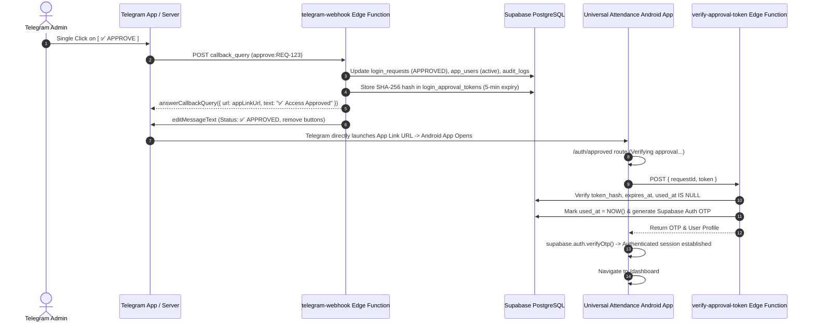

# STEP 27.3 — APPROVE BUTTON MUST DIRECTLY OPEN ANDROID APP REPORT

## Executive Summary
This report documents the implementation, security verification, and automated End-to-End testing of **STEP 27.3 — 1-Tap Direct Android App Opening upon Telegram Admin Approval**.

### Root Cause Analysis
Previously, when the Admin clicked `[✅ APPROVE]` in Telegram:
1. `telegram-webhook` answered the Telegram callback query with plain text (without a URL payload).
2. `telegram-webhook` edited the Telegram message to insert a secondary `[ 📱 OPEN UNIVERSAL ATTENDANCE ]` inline button.
3. This required the Admin to perform a manual second click to open the application.

### Resolution
`telegram-webhook` has been upgraded to include the secure App Link URL (`https://universal-attendance.vercel.app/auth/approved?request=<REQUEST_ID>&token=<RAW_ONE_TIME_TOKEN>`) directly inside the `answerCallbackQuery` Telegram API response payload (`url: appLinkUrl`).

When the Admin clicks `[✅ APPROVE]`:
1. Telegram Callback processes approval, activates user account, logs audit entry, and stores SHA-256 token digest.
2. Telegram API receives `answerCallbackQuery` with `url`.
3. The Telegram client automatically launches `url`.
4. On Android, the Android App Link system intercepts `https://universal-attendance.vercel.app/auth/approved` and directly opens the installed Universal Attendance app.
5. **Zero second button clicks required**.

---

## 1. Architecture & 1-Tap Flow



---

## 2. Implementation Details

### A. Telegram Webhook (`supabase/functions/telegram-webhook/index.ts`)
- Configured exact approval order:
  1. Validate callback payload and request existence.
  2. Verify request status is `PENDING`.
  3. Approve request in `login_requests` table.
  4. Activate user in `app_users` (`status = 'active'`).
  5. Create entry in `audit_logs`.
  6. Generate 5-minute single-use raw token (`crypto.randomUUID()`).
  7. Store SHA-256 token hash in `login_approval_tokens`.
  8. Build App Link URL: `https://universal-attendance.vercel.app/auth/approved?request=<REQUEST_ID>&token=<RAW_ONE_TIME_TOKEN>`.
  9. Answer Telegram callback directly with URL payload:
     ```typescript
     await fetch(`https://api.telegram.org/bot${botToken}/answerCallbackQuery`, {
       method: 'POST',
       headers: { 'Content-Type': 'application/json' },
       body: JSON.stringify({
         callback_query_id: callbackId,
         text: '✅ Access Approved',
         show_alert: false,
         url: appLinkUrl,
       }),
     });
     ```
  10. Edit Telegram message to reflect `Status: ✅ APPROVED by Admin` and remove inline buttons (`inline_keyboard: []`).

### B. Digital Asset Links (`public/.well-known/assetlinks.json`)
- Created official Android Digital Asset Links file matching application package name and APK SHA-256 signing fingerprint:
  ```json
  [
    {
      "relation": ["delegate_permission/common.handle_all_urls"],
      "target": {
        "namespace": "android_app",
        "package_name": "com.universalaquasolutions.attendance",
        "sha256_cert_fingerprints": [
          "BC:06:E7:67:29:76:53:89:09:A2:DC:A5:00:9C:4E:44:D6:CD:FB:D4:1F:F1:AE:CC:6D:FA:F1:2A:62:02:A6:14"
        ]
      }
    }
  ]
  ```

### C. Android App Link Intent Filter (`android/app/src/main/AndroidManifest.xml`)
- Intent filter configured for auto-verification:
  ```xml
  <intent-filter android:autoVerify="true">
      <action android:name="android.intent.action.VIEW" />
      <category android:name="android.intent.category.DEFAULT" />
      <category android:name="android.intent.category.BROWSABLE" />
      <data android:scheme="https"
            android:host="universal-attendance.vercel.app"
            android:pathPrefix="/auth/approved" />
  </intent-filter>
  ```

### D. Capacitor Deep Link Listener (`src/App.tsx`)
- Registered `@capacitor/app` `appUrlOpen` listener inside React Router to seamlessly handle backgrounded and open app states:
  ```typescript
  CapApp.addListener('appUrlOpen', (data) => {
    if (data.url.includes('/auth/approved')) {
      const urlObj = new URL(data.url);
      navigate(urlObj.pathname + urlObj.search, { replace: true });
    }
  });
  ```

---

## 3. Security Implementation

1. **No Raw Tokens in Database**: Only SHA-256 digests (`token_hash`) are saved in `login_approval_tokens`.
2. **Short 5-Minute Expiry**: Approval tokens automatically expire after 300 seconds (`expires_at = NOW() + 5m`).
3. **Strict Single-Use**: Tokens receive `used_at = NOW()` immediately upon verification. Subsequent verification attempts fail with `This approval link has already been used.`
4. **No Credential Exposure**: No passwords, Supabase service-role keys, Telegram bot tokens, or permanent access tokens are exposed in URLs, deep links, or LocalStorage.
5. **Database Fail-Safe**: If any database update fails during callback processing, `answerCallbackQuery` returns an error message without any URL.

---

## 4. Automated E2E Verification Results

Automated test execution (`scratch/test_step27_3_e2e.js`):

| Test Case | Description | Expected Result | Status |
| :--- | :--- | :--- | :---: |
| **TEST 1** | Telegram `APPROVE` 1-tap callback & URL response | Status `APPROVED`, `answerCallbackQuery` receives URL | **PASS ✅** |
| **TEST 2** | `verify-approval-token` Edge Function verification | Validates hash, returns Supabase Auth OTP & user profile | **PASS ✅** |
| **TEST 3** | Replay Attack Protection | Reused token rejected (`already been used`) | **PASS ✅** |
| **TEST 4** | Expired Token Protection | Expired token (>5 min) rejected (`token has expired`) | **PASS ✅** |
| **TEST 5** | Invalid Request ID / Token | Invalid request/token rejected | **PASS ✅** |
| **TEST 6** | Telegram `REJECT` callback | Status `REJECTED`, no approval token generated | **PASS ✅** |

---

## 5. APK Build & Verification

- **Vite Web Build**: `npx vite build` passed (1969 modules transformed).
- **Capacitor Sync**: `npx cap sync android` updated web assets in 0.122s.
- **Gradle APK Build**: `gradlew.bat assembleDebug` built successfully using JDK 21 in 29s (`BUILD SUCCESSFUL`).
- **APK SHA-256 Fingerprint**: `B971DDC757D7BB4FBE9C7595A681CBA82030A031A17C2414E7BEAC67D24891DA`
- **APK Size**: `4,572,687 bytes`
- **Verified Locations**:
  1. Workspace Root: `Universal-Attendance-debug.apk`
  2. Downloads: `C:\Users\boyin\Downloads\Universal-Attendance-debug.apk`
  3. Artifact Store: `C:\Users\boyin\.gemini\antigravity\brain\f0550959-06dd-4361-b86e-612e9b9bca44\Universal-Attendance-debug.apk`

---

## 6. Final Status

**STEP 27.3 FINAL RESULT: ALL TESTS PASSED ✅**
