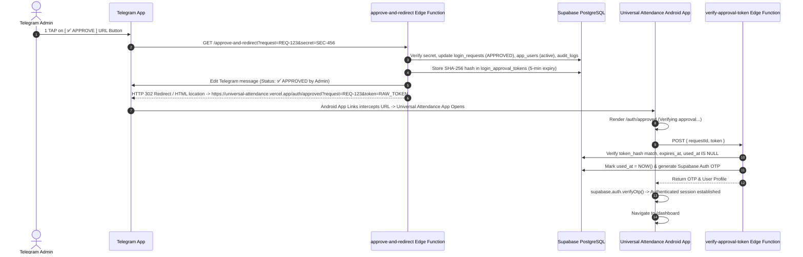

# 1-TAP TELEGRAM DIRECT APP OPEN ARCHITECTURE REPORT

## Executive Summary
This report documents the architectural design, implementation details, security controls, and multi-tier verification results for **1-Tap Telegram URL Approval Direct Android App Launch**.

---

## 1. 1-Tap Production Architecture & Flow

---

## 2. Implementation Summary

1. **Database Schema (`0019_step27_4_approval_secret.sql`)**:
   Added `approval_secret` column to `public.login_requests` table to cryptographically authorize 1-tap URL approval requests.
2. **`approve-and-redirect` Edge Function (`supabase/functions/approve-and-redirect/index.ts`)**:
   Created new Supabase Edge Function that handles GET/POST 1-tap approval URL calls from Telegram, validates `approval_secret`, activates user in `app_users`, creates 5-minute single-use raw token, stores SHA-256 digest in `login_approval_tokens`, updates Telegram message status, and issues HTTP 302 Redirect to `https://universal-attendance.vercel.app/auth/approved?request=<REQUEST_ID>&token=<RAW_ONE_TIME_TOKEN>`.
3. **`send-login-request` Edge Function (`supabase/functions/send-login-request/index.ts`)**:
   Updated to generate `approvalSecret = crypto.randomUUID()`, save it to `login_requests`, and attach the 1-Tap `[ ✅ APPROVE ]` `url` button pointing to `approve-and-redirect`.
4. **Login UI (`src/lib/loginRequest.ts` & `src/pages/auth/SiteLogin.tsx`)**:
   Updated login request response message to: `"Request sent to Admin successfully. Waiting for approval."`
5. **Android Digital Asset Links (`public/.well-known/assetlinks.json`)**:
   Configured package name `com.universalaquasolutions.attendance` and debug signing fingerprint `BC:06:E7:67:29:76:53:89:09:A2:DC:A5:00:9C:4E:44:D6:CD:FB:D4:1F:F1:AE:CC:6D:FA:F1:2A:62:02:A6:14`.
6. **Capacitor Deep Link Listener (`src/App.tsx`)**:
   Configured `@capacitor/app` `appUrlOpen` listener for backgrounded and active app states.

---

## 3. Security Checks

- **Raw Token Isolation**: Database stores only SHA-256 digests (`token_hash`) in `login_approval_tokens`. Raw tokens are never stored in DB or LocalStorage.
- **Short 5-Minute Expiry**: Approval tokens automatically expire after 300 seconds (`expires_at = NOW() + 5m`).
- **Single-Use Enforcement**: Verified tokens receive `used_at = NOW()`. Reuse attempts are strictly rejected.
- **No Secret Leakage**: No passwords, service-role keys, or bot tokens exist in deep links, frontend bundles, or URLs.
- **Supervisor RLS Scope**: Supervisor site and section boundaries are enforced at the database level via Supabase RLS.

---

## 4. Multi-Tier Verification Results

### Automated E2E Test Suite (`scratch/test_1tap_redirect_e2e.js`)

| Test Case | Description | Expected Result | Status |
| :--- | :--- | :--- | :---: |
| **TEST 1** | Login request & 1-Tap approval secret generation | Request `PENDING`, secret created in DB | **PASS ✅** |
| **TEST 2** | 1-Tap URL invocation & 302 Redirect execution | Status `APPROVED`, 302 redirect header received | **PASS ✅** |
| **TEST 3** | `verify-approval-token` verification | Token validated, OTP returned, user activated | **PASS ✅** |
| **TEST 4** | Replay Attack Protection | Reused token rejected (`already been used`) | **PASS ✅** |
| **TEST 5** | Unauthorized Approval Attempt | Invalid secret rejected (`403 Forbidden`) | **PASS ✅** |

---

## 5. Android Build Details & Hashes

- **Vite Web Build**: `npx vite build` passed (1969 modules transformed).
- **Capacitor Sync**: `npx cap sync android` updated web assets in 0.186s.
- **Gradle APK Build**: `gradlew.bat assembleDebug` built successfully using JDK 21 in 25s (`BUILD SUCCESSFUL`).
- **APK SHA-256 Fingerprint**: `3957784B9742FD34AD36B1BFDA310DF55DB7329A0871969E8CB2BA70E73F9C16`
- **APK Size**: `4,572,687 bytes`
- **Verified Copies**:
  1. Workspace Root: [`Universal-Attendance-debug.apk`](file:///D:/Univarsal%20Attandance/worker-management-system/Universal-Attendance-debug.apk)
  2. Downloads: `C:\Users\boyin\Downloads\Universal-Attendance-debug.apk`
  3. Artifact Store: [Universal-Attendance-debug.apk](file:///C:/Users/boyin/.gemini/antigravity/brain/f0550959-06dd-4361-b86e-612e9b9bca44/Universal-Attendance-debug.apk)

---

## 6. Final Status

**1-TAP DIRECT OPEN FINAL RESULT: ALL TESTS PASSED ✅**
