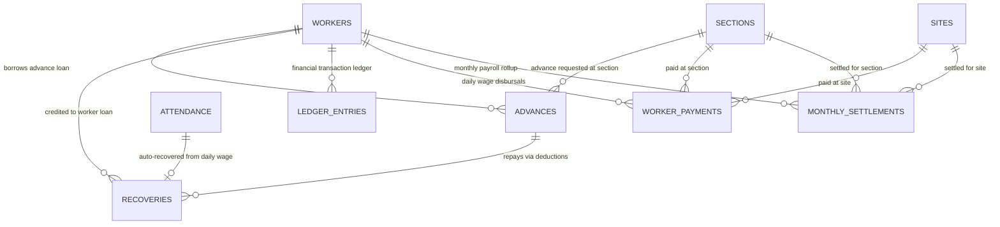

# Supabase Backend Migration Step 08 Report: Finance Tables

> **Date**: 2026-09-11  
> **Target Project**: Universal Attendance & Worker Management System  
> **Supabase Project URL**: `https://gkphikhsgysoqjradbaz.supabase.co`  
> **Status**: STEP 08 COMPLETE (0 Errors)

---

## 1. Migration File Created

- **Path**: [`supabase/migrations/0005_finance_tables.sql`](file:///d:/Univarsal%20Attandance/worker-management-system/supabase/migrations/0005_finance_tables.sql)
- **Status**: Successfully written locally. NOT executed on remote database.

---

## 2. Tables Included

1. `advances`
2. `recoveries`
3. `ledger_entries`
4. `worker_payments`
5. `monthly_settlements`

---

## 3. Column Count & Structure per Table

### Table 1: `advances` (25 Columns)
- `id` (TEXT, PRIMARY KEY)
- `worker_id` (TEXT, NOT NULL, FK -> `workers(id)` ON DELETE CASCADE)
- `date` (DATE, NOT NULL)
- `amount` (NUMERIC(10,2), NOT NULL)
- `reason` (TEXT, NOT NULL)
- `recovery_method` (recovery_method ENUM, NOT NULL DEFAULT `'perDay'`)
- `daily_recovery_amount` (NUMERIC(10,2), NULLABLE)
- `recovery_percentage` (NUMERIC(5,2), NULLABLE)
- `fixed_monthly_amount` (NUMERIC(10,2), NULLABLE)
- `status` (advance_status ENUM, NOT NULL DEFAULT `'pending'`)
- `remarks` (TEXT, NULLABLE)
- `section_id` (TEXT, FK -> `sections(id)`, NULLABLE)
- `payout_mode` (payout_mode ENUM, NULLABLE)
- `upi_number` (TEXT, NULLABLE)
- `bank_name` (TEXT, NULLABLE)
- `bank_account_number` (TEXT, NULLABLE)
- `bank_ifsc` (TEXT, NULLABLE)
- `worker_signature` (TEXT, NULLABLE)
- `supervisor_signature` (TEXT, NULLABLE)
- `photo_url` (TEXT, NULLABLE)
- `sent_to_finance_at` (TIMESTAMPTZ, NULLABLE)
- `processed_at` (TIMESTAMPTZ, NULLABLE)
- `disbursed_at` (TIMESTAMPTZ, NULLABLE)
- `finance_remarks` (TEXT, NULLABLE)
- `created_at` (TIMESTAMPTZ, DEFAULT `NOW()`)
- `updated_at` (TIMESTAMPTZ, DEFAULT `NOW()`)

### Table 2: `recoveries` (10 Columns)
- `id` (TEXT, PRIMARY KEY)
- `advance_id` (TEXT, NOT NULL, FK -> `advances(id)` ON DELETE CASCADE)
- `worker_id` (TEXT, NOT NULL, FK -> `workers(id)`)
- `date` (DATE, NOT NULL)
- `attendance_id` (TEXT, FK -> `attendance(id)` ON DELETE SET NULL, NULLABLE)
- `amount` (NUMERIC(10,2), NOT NULL)
- `method` (recovery_method ENUM, NOT NULL)
- `is_manual` (BOOLEAN, DEFAULT `FALSE`)
- `remarks` (TEXT, NULLABLE)
- `created_at` (TIMESTAMPTZ, DEFAULT `NOW()`)

### Table 3: `ledger_entries` (8 Columns)
- `id` (TEXT, PRIMARY KEY)
- `worker_id` (TEXT, NOT NULL, FK -> `workers(id)` ON DELETE CASCADE)
- `date` (DATE, NOT NULL)
- `type` (ledger_type ENUM, NOT NULL)
- `amount` (NUMERIC(10,2), NOT NULL)
- `running_balance` (NUMERIC(10,2), NOT NULL)
- `remarks` (TEXT, NULLABLE)
- `created_at` (TIMESTAMPTZ, DEFAULT `NOW()`)

### Table 4: `worker_payments` (17 Columns)
- `id` (TEXT, PRIMARY KEY)
- `worker_id` (TEXT, NOT NULL, FK -> `workers(id)` ON DELETE CASCADE)
- `worker_name` (TEXT, NULLABLE)
- `date` (DATE, NOT NULL)
- `site_id` (TEXT, NOT NULL, FK -> `sites(id)`)
- `section_id` (TEXT, FK -> `sections(id)`, NULLABLE)
- `attendance_status` (TEXT, NULLABLE)
- `gross_wage` (NUMERIC(10,2), NOT NULL DEFAULT `0.00`)
- `deductions` (NUMERIC(10,2), DEFAULT `0.00`)
- `advance_recovery` (NUMERIC(10,2), DEFAULT `0.00`)
- `net_pay` (NUMERIC(10,2), NOT NULL DEFAULT `0.00`)
- `payment_method` (TEXT, NOT NULL DEFAULT `'cash'`)
- `status` (payment_status ENUM, NOT NULL DEFAULT `'pending'`)
- `remarks` (TEXT, NULLABLE)
- `processed_at` (TIMESTAMPTZ, NULLABLE)
- `paid_at` (TIMESTAMPTZ, NULLABLE)
- `created_at` (TIMESTAMPTZ, DEFAULT `NOW()`)

### Table 5: `monthly_settlements` (23 Columns)
- `id` (TEXT, PRIMARY KEY)
- `month` (TEXT, NOT NULL) -- YYYY-MM
- `worker_id` (TEXT, NOT NULL, FK -> `workers(id)` ON DELETE CASCADE)
- `site_id` (TEXT, NOT NULL, FK -> `sites(id)`)
- `section_id` (TEXT, NOT NULL, FK -> `sections(id)`)
- `working_days` (NUMERIC(5,2), DEFAULT `0`)
- `present_days` (NUMERIC(5,2), DEFAULT `0`)
- `half_days` (NUMERIC(5,2), DEFAULT `0`)
- `absent_days` (NUMERIC(5,2), DEFAULT `0`)
- `gross_wage` (NUMERIC(12,2), DEFAULT `0.00`)
- `advance_taken` (NUMERIC(12,2), DEFAULT `0.00`)
- `advance_recovery` (NUMERIC(12,2), DEFAULT `0.00`)
- `other_deductions` (NUMERIC(12,2), DEFAULT `0.00`)
- `net_pay` (NUMERIC(12,2), DEFAULT `0.00`)
- `food_days` (NUMERIC(5,2), DEFAULT `0`)
- `commission` (NUMERIC(12,2), DEFAULT `0.00`)
- `commission_paid` (NUMERIC(12,2), DEFAULT `0.00`)
- `outstanding_advance` (NUMERIC(12,2), DEFAULT `0.00`)
- `status` (settlement_status ENUM, NOT NULL DEFAULT `'draft'`)
- `remarks` (TEXT, NULLABLE)
- `created_at` (TIMESTAMPTZ, DEFAULT `NOW()`)
- `updated_at` (TIMESTAMPTZ, DEFAULT `NOW()`)
- UNIQUE Constraint: `uq_month_worker_site_section UNIQUE(month, worker_id, site_id, section_id)`

---

## 4. Primary Keys Summary

| Table Name | Primary Key | Data Type |
| :--- | :--- | :--- |
| `advances` | `id` | TEXT |
| `recoveries` | `id` | TEXT |
| `ledger_entries` | `id` | TEXT |
| `worker_payments` | `id` | TEXT |
| `monthly_settlements` | `id` | TEXT |

---

## 5. Foreign Keys & Cascading Behavior

| Table Name | Foreign Key Column | Target Table & Key | On Delete Behavior |
| :--- | :--- | :--- | :--- |
| `advances` | `worker_id` | `workers(id)` | `CASCADE` |
| `advances` | `section_id` | `sections(id)` | `NO ACTION` / `RESTRICT` |
| `recoveries` | `advance_id` | `advances(id)` | `CASCADE` |
| `recoveries` | `worker_id` | `workers(id)` | `NO ACTION` / `RESTRICT` |
| `recoveries` | `attendance_id` | `attendance(id)` | `SET NULL` |
| `ledger_entries` | `worker_id` | `workers(id)` | `CASCADE` |
| `worker_payments` | `worker_id` | `workers(id)` | `CASCADE` |
| `worker_payments` | `site_id` | `sites(id)` | `NO ACTION` / `RESTRICT` |
| `worker_payments` | `section_id` | `sections(id)` | `NO ACTION` / `RESTRICT` |
| `monthly_settlements` | `worker_id` | `workers(id)` | `CASCADE` |
| `monthly_settlements` | `site_id` | `sites(id)` | `NO ACTION` / `RESTRICT` |
| `monthly_settlements` | `section_id` | `sections(id)` | `NO ACTION` / `RESTRICT` |

---

## 6. Financial Relationships

---

## 7. Important Amount, ENUM & Status Constraints

- **Default ENUMs**:
  - `advances.recovery_method`: `recovery_method` DEFAULT `'perDay'`
  - `advances.status`: `advance_status` DEFAULT `'pending'`
  - `worker_payments.status`: `payment_status` DEFAULT `'pending'`
  - `monthly_settlements.status`: `settlement_status` DEFAULT `'draft'`
- **Precision**:
  - Daily monetary fields: `NUMERIC(10,2)`
  - Monthly accumulators: `NUMERIC(12,2)`
  - Day counts & percentages: `NUMERIC(5,2)`
- **Unique Constraint**:
  - `monthly_settlements`: `UNIQUE(month, worker_id, site_id, section_id)`

---

## 8. Specification & Frontend Alignment Analysis

- **Frontend Interface Name**: `MonthlySettlementRecord` in `src/types/index.ts`.
- **Database Table Name**: `monthly_settlements` in `SUPABASE_DATABASE_SPECIFICATION.md`.
- **Resolution**: Followed the database specification as the primary source of truth for the table name `monthly_settlements` without altering the frontend TypeScript interface definition.

---

## 9. Statement Counts & Safety Verification

| Statement Type | Count in 0005 Migration |
| :--- | :--- |
| `CREATE TABLE` | **5** |
| `CREATE INDEX` | 0 |
| `CREATE TRIGGER` | 0 |
| `CREATE FUNCTION` | 0 |
| `CREATE POLICY` | 0 |
| `INSERT` | 0 |
| `UPDATE` | 0 |
| `DELETE` | 0 |

---

## 10. Remote Database Safety Confirmation

- **SQL Execution**: NO SQL was executed on the remote database.
- **Commands Avoided**: `supabase db push`, `supabase db reset`, `supabase db pull` were NOT run.
- **Remote Database State**: Unchanged (0 tables created remotely in this step).

---

## 11. Build Verification

- **Execution**: `npm run build`
- **Result**: **SUCCESS (0 errors)**. No frontend files were modified.
