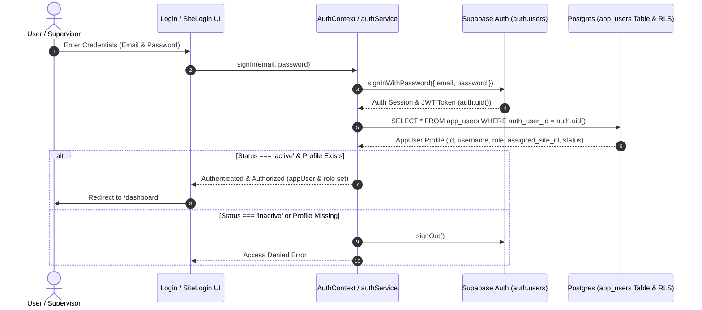

# Supabase Backend Migration Step 13 Report: Supabase Authentication & Role Integration

> **Date**: 2026-09-11  
> **Target Project**: Universal Attendance & Worker Management System  
> **Supabase Project URL**: `https://gkphikhsgysoqjradbaz.supabase.co`  
> **Status**: STEP 13 COMPLETE (0 Errors)

---

## 1. Existing Authentication Architecture vs Supabase Auth Architecture

- **Previous Flow**: Local state and `localStorage` session handling (`univarsal_user_session`) verifying username/password against local `mockAppUsers` array in `AttendanceContext.tsx`.
- **New Supabase Auth Architecture**:
  - **Authentication Authority**: Supabase Auth (`auth.users`).
  - **User Profile Link**: `auth.users.id` $\leftrightarrow$ `app_users.auth_user_id`.
  - **Authorization & RLS**: Database Row Level Security (STEP 11 RLS policies) uses `get_auth_user_role()` and `get_auth_user_site()` to enforce database-level access rules based on `app_users.role` (`admin` | `supervisor`) and `app_users.assigned_site_id`.

---

## 2. Files Created & Modified

### Files Created:
1. [`src/lib/auth.ts`](file:///d:/Univarsal%20Attandance/worker-management-system/src/lib/auth.ts): Authentication service layer wrapping Supabase Auth methods (`signIn`, `signOut`, `getCurrentSession`, `getCurrentUser`, `fetchAppUserProfile`, `onAuthStateChange`).
2. [`src/context/AuthContext.tsx`](file:///d:/Univarsal%20Attandance/worker-management-system/src/context/AuthContext.tsx): React Auth Context & `useAuth()` hook for managing `authenticatedUser`, `session`, `appUser`, `role`, and site/section scoping.
3. [`SUPABASE_MIGRATION_STEP_13_REPORT.md`](file:///d:/Univarsal%20Attandance/worker-management-system/SUPABASE_MIGRATION_STEP_13_REPORT.md): Step report and security documentation.

### Files Modified:
1. [`src/App.tsx`](file:///d:/Univarsal%20Attandance/worker-management-system/src/App.tsx): Added `AuthProvider` context wrapping around `AttendanceProvider` and `AppRoutes`.

### Files Unchanged (Backward Compatibility Preserved):
- Migration files [`0001`](file:///d:/Univarsal%20Attandance/worker-management-system/supabase/migrations/0001_extensions_enums.sql) through [`0009`](file:///d:/Univarsal%20Attandance/worker-management-system/supabase/migrations/0009_realtime.sql) remain 100% untouched.
- `AttendanceContext.tsx` and `localStorage` state management remain fully operational.

---

## 3. Detailed Authentication & Profile Mapping Flow

---

## 4. Role & Authorization Model

- **`admin` Role**:
  - Full central portal authorization (`get_auth_user_role() = 'admin'`).
  - Database RLS permits unrestricted access to all sites, sections, workers, settlements, advances, and user accounts.
- **`supervisor` Role**:
  - Restricted to assigned site (`get_auth_user_site()`).
  - Database RLS automatically isolates queries and mutations to rows matching `assigned_site_id`.

---

## 5. Security & Configuration Audit

| Security Item | Verification Status | Rationale / Details |
| :--- | :---: | :--- |
| **Service Role Key in Frontend** | **NONE** | Verified: `src/lib/supabase.ts` uses only public `VITE_SUPABASE_URL` and `VITE_SUPABASE_PUBLISHABLE_KEY`. |
| **Plaintext Password Storage** | **NONE** | No passwords stored or queried from frontend or migrations. |
| **RLS Policy Integrity** | **INTACT** | STEP 11 policies (`0008_rls_policies.sql`) govern database access. |
| **Anonymous (`anon`) Access** | **DISABLED** | Zero broad `anon` access granted. |
| **Auth State Listener** | **IMPLEMENTED** | `supabase.auth.onAuthStateChange` listens for `SIGNED_IN`, `SIGNED_OUT`, `TOKEN_REFRESHED` with proper cleanup. |
| **Remote Database Modification** | **NONE** | `supabase db push` was **NOT** executed. Remote database remains unchanged. |

---

## 6. Build Verification

- **Command Executed**: `npm run build`
- **Result**: **SUCCESS (0 errors)**
